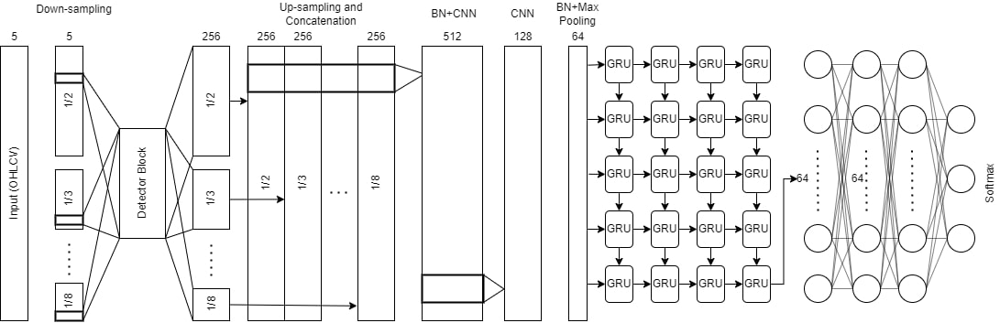
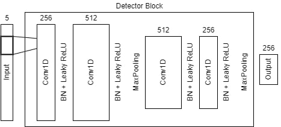
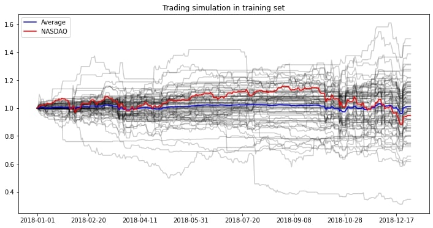
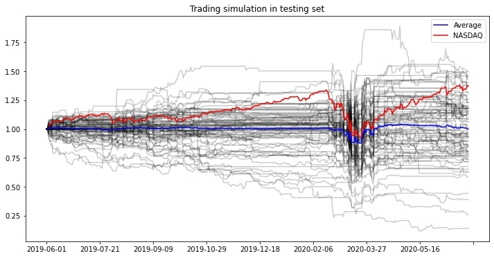
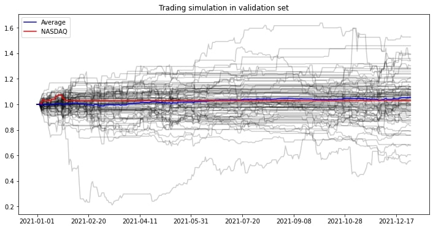
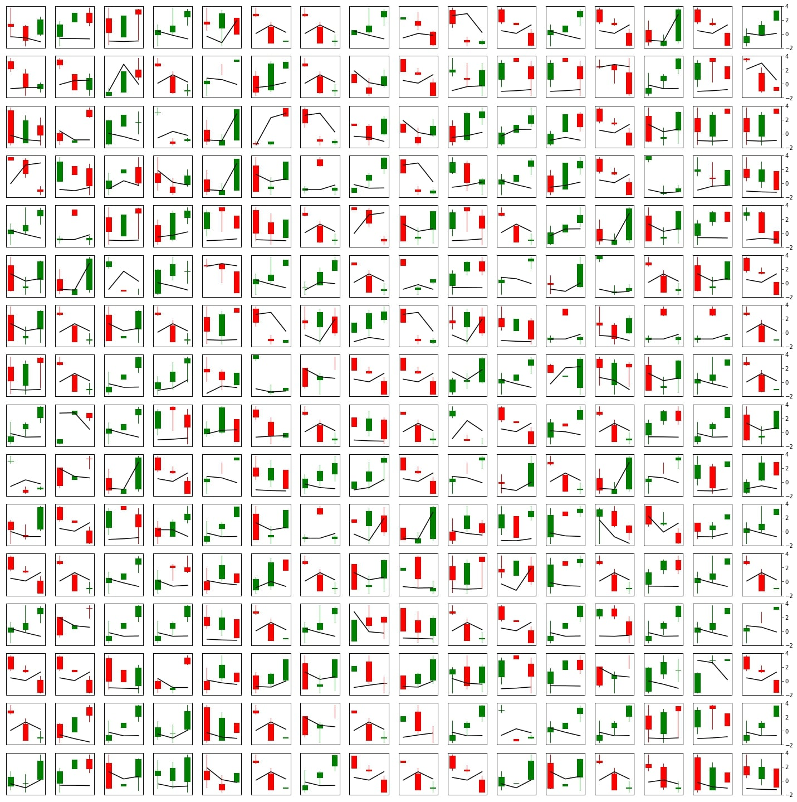

# Multiscale CNN-GRU network for market trend predictor

Disclaimer: This repository is part of the course project of my Master's degree in HKU.

# Introduction

We observed that stock price has self-similarity across time. The fluctuation of stock price in one week is similar to fluctuation in one month. Based on this belief, we have built a multiscale CNN-GRU network to model the market trend. In the following, we will introduce our experiment setup, model architecture, evaluation and visualization. 

# Data

## Data Source
Data are crawled from Yahoo Finance. Data crawlling script is uploaded in the repository.

## Dataset description

We aimed at modelling long term stock trend using OHLCV (open, high, low, close, volume). We targeted all constituents (98) of NASDAQ in US market. 

## Record format

For each date, we will query the SQL database with its past 512-day OHLCV, resulting a matrix with length 512 day and 5 channels.

## Labelling method

We have used “triple barrier method” purposed by De Prado (2018). For each stock at each date, we label by whether stock price breaks through a predefined upper, lower limits and maximum holding period. We have used 110% as upper limit (uptrend), 90% as lower limit (downtrend) and 20 days as maximum holding period (steady). 

## Dataset statistics

|            | From       | To         | No. of days | No. of records |
|------------|------------|------------|-------------|----------------|
| Dataset    | 1970-01-02 | 2022-03-23 | 13380       | -              |
| Training   | 2009-01-01 | 2018-12-31 | 2556        | 177468         |
| Testing    | 2019-06-01 | 2020-06-30 | 277         | 7855           |
| Validation | 2021-01-01 | 2021-12-31 | 259         | 6659           |

We have used 12 years stock prices from NASDAQ, where 10 years for training, 1 year for testing and validation, and two 0.5-year break inserted between datasets. 

|            | Downtrend     | Steady         | Uptrend       |
|------------|---------------|----------------|---------------|
| Training   | 18133 (10.2%) | 130915 (73.8%) | 28420 (16.0%) |
| Testing    | 1808 (23.0%)  | 2672 (34.0%)   | 3375 (43.0%)  |
| Validation | 1331 (20.0%)  | 4145 (62.2%)   | 1183 (17.8%)  |

We can observe that class labels are unbalanced. In both training and validation sets, over 60% are steady labels, while in testing set, majority is uptrend. Besides, there is a significant shift in distribution of labels, which impose difficulty for model training. 

# Model architecture 
## Overview



## Detector block



Given Input of a series with 5 channels and length 512, detector block will first apply an 1D same-padding convolution to increase the channels into 256, followed by batch normalization and leaky ReLU. The process repeated with 512 channels, and maximum pooling applied. This will shrink the series length by half into 256. The process repeated twice with channel size 512 and 256, and maximum pooling applied, producing a series with length 128 and channel 256 as output. 

## Workflow
<ins>Input</ins>

512-day stock’s OHLCV will be normalized first. We used adjusted close divided by close to obtain adjustment factor, multiply this factor to OHLC and apply standardization respectively. Volume is standardized by backward rolling 20 days window to feature local fluctuation of stock price. Adjusted and standardized OHLCV will be stacked into a time series with 5 channels, producing a series with length 512 and 5 channels. 

<ins>Down-sampling</ins>

The series will be duplicated and down-sampled by factor of 2, 3, …, 8. For each sample, they will be passed into a global detector block, producing 7 series with length 128 and channels 256. 

<ins>Up-sampling and concatenation</ins>

All 7 series will be up-sampled into length 128 and concatenated in channel direction, resulting in 1792 channels. 

<ins>Dimension reduction by CNN </ins>

Batch normalization will be applied first. Because the number of channels is too high, we applied two CNN with channels 512 and 128. After batch normalization and maximum pooling in channel direction, it further reduces the channel into 64. Up till now, we have obtained an embedding of time series with length 128 and 64 channels. 

<ins>Dimension reduction by GRU</ins>

In order to condense the embedding into a single vector, a 4-layer GRU is applied. For each timeframe, a slice of series will be treated as a 64-dimension feature vector of that timeframe and passed into GRU network. Finally, after the GRU network has processed the whole time series, its 64-dimension state vector will be extracted and treated as the finally embedding of whole time series. 

<ins>Fully connected layers</ins>

The final embedding with 64 dimensions will be passed into 3 fully connected layers with 64, 64, 3 neurons. SoftMax will be used on 3-dimensional vector and producing class probabilities.

# Performance
## Classification scores

We have chosen to present the confusion matrix and weighted one-vs-rest ROC AUC score as evaluation methods for training, testing and validation sets. Because of imbalanced labels, simply presenting common metrics such as accuracy, precision and recall may be misleading. Hence, the whole confusion matrix is presented for analysis. Besides, although AUC can only be used in binary classification, by applying one-vs-all strategy, we can calculate the AUC for all three classes and report their weighted average as final AUC score. 

### Training set

AUC in training set is 0.577, which shows that the model is slightly outperforming the random guess. 

| True \ Pred (Train) | Downtrend | Steady | Uptrend |
|---------------------|-----------|--------|---------|
| Downtrend            | 5514      | 9192   | 3427    |
| Steady              | 28771     | 80355  | 21789   |
| Uptrend             | 8442      | 13828  | 6150    |

From the confusion matrix, we can observe that the model tends to predict steady in all scenarios, indicating an underfit and failure in capturing features, even in the training set.

### Testing set

AUC of the testing set is 0.560. Also, the model is slightly outperforming the random guess.

| True \ Pred (Test) | Downtrend | Steady | Uptrend |
|--------------------|-----------|--------|---------|
| Downtrend           | 237       | 687    | 884     |
| Steady             | 630       | 1667   | 375     |
| Uptrend            | 508       | 1541   | 1326    |

From the confusion matrix, the model tends to make steady prediction, followed by uptrend, because most of the downtrend samples are predicted as uptrend. This may because the majority of the labels in testing set is uptrend. 

### Validation set

AUC of the validation set is 0.503. Despite showing that the model is slightly outperforming the random guess, the model deteriorates when time propagate from the training set. 

| True \ Pred (Validation) | Downtrend | Steady | Uptrend |
|--------------------------|-----------|--------|---------|
| Downtrend                | 105       | 829    | 397     |
| Steady                   | 567       | 2456   | 1122    |
| Uptrend                  | 73        | 750    | 360     |

From the confusion matrix, similar conclusions can be observed as majority of the predicted labels are steady, and non-steady labels are usually predicted as uptrend. 

## Trading simulations

In the following, 1-year trading simulations using everyday model prediction on train, test and validation sets are plotted as below. Pale black lines are trading simulation of all NASDAQ constituents, blue line is representing average model performance, and red line is actual NASDAQ price movement.

### Training set

Return of our model is 1.21%, compared with -5.30% in NASDAQ. From the fact that most of time the black lines are flat, we can observe that the model tends not holding stocks. Also, most of the time the model cannot outperform the NASDAQ, except in the last month when NASDAQ drop a lot. Hence, it is believed that the model cannot significantly increase profitability.



### Testing set

Return of our model is 0.21%, compared with 37.17% in NASDAQ. Because the model tends not holding stocks, the model performance cannot catch up the raising trend of NASDAQ, resulting in a huge loss in potential profitability. 



### Validation set

Return of our model is 5.26%, compared with 2.93% in NASDAQ. Although the model slightly outperformed the NASDAQ at the end, their differences are not significant. 



# Filter visualization

When a model is well-performed, we can receive insight from the model. Although our model is unsatisfactory, we still would like to take this chance to visualize the 1st layer filters in the model. Local receptive field of 1st layer CNN filters are 3-day OHLCV. For each filter, we have scanned through the test and validation sets to find a 3-day sample with maximum absolute response as filter’s representation. The representations are displayed below. The green and red elements representing candle sticks of each day, and black lines representing volatility, renormalized into zero mean and unit variance. 



To further classify each filter into different market trends, we have set the output of 1st layer CNN to be a particular filter, and let the model determine which class it is corresponding to. 

In mathematic expression, for each filter index $idx$, let the model after 1st layer CNN be $\mathcal{F}: ℝ^{512×256} → ℝ^3$, we have used $𝑥 = [𝑎_{𝑖𝑗}] ∈ ℝ^{512×256}$,

```math
$a_{ij}= 
\begin{cases}
    1,& \text{if } j = idx\\
    0,& \text{otherwise}
\end{cases}
$
```
as input and assign the predicted class by $argmax(\mathcal{F}(𝑥))$. However, because the following batch normalization layer will zero out all signals, and we have added random noise into 𝑥 using $\epsilon_{ij} \sim \mathcal{U}(-0.005, 0.005)$, resulting in $x_{salted} = [\epsilon_{ij} + \delta_{j, idx}]$, where $\delta$ is the Kronecker delta function. 

Note that this kind of evaluation do not have solid ground, and the GRU layer may distort the result, because interaction of features across time may be crucial but ignored in this simulation. In this setting, the uptrend filters are:

.jpg)

The downtrend filters are:

.jpg)

The steady filters are:

.jpg)

# Conclusion

In terms of classification score, although the model is slightly outperformed the random guess, its AUC score is still too low, indicating underfitting and failure in capturing features. From the confusion matrix, the model tends to make steady prediction, and often label downtrend as uptrend. From the trading simulations, we can observe that the model tends to not holding stock, cannot catch up with the bullish market environment, and cannot significantly outperform the NASDAQ index. If we take trading fee into consideration, the performance is even worse. Finally, although the model is not good, we have visualized model’s 1st layer weights into candle stick plots. However, readers should pay attention to the ungrounded methodologies we have applied.
